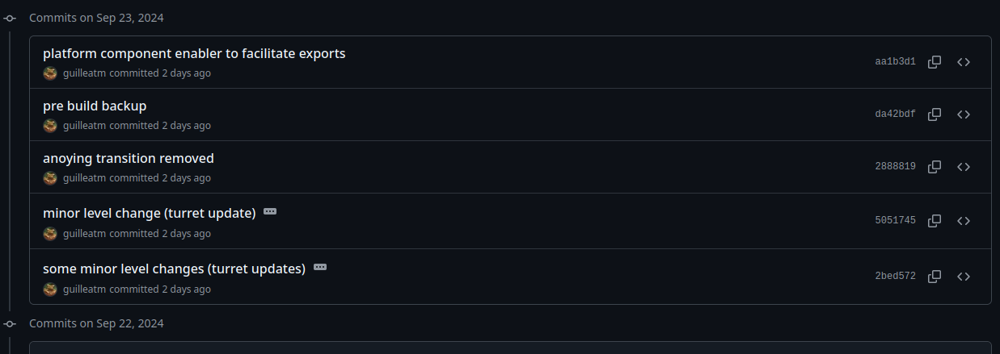

<!-- # Git

[Git](https://git-scm.com/) es un [Sistema de Control de Versiones [*]](concepts.md#sistema-de-control-de-versiones) que nos permite gestionar y hacer un seguimiento de los cambios en nuestros archivos a lo largo del tiempo. Es utilizado para mantener un historial de modificaciones, facilitando la colaboración en proyectos de software.

> Git es extenso y complejo aunque hay mucha [documentación](https://git-scm.com/docs) y tutoriales.

> Es un software [FOSS](https://git-scm.com/about/free-and-open-source) y es utilizado por grandes empresas en el sector tecnológico como Google, Linkedin, Netflix, Twitter o Linux entre otras, puedes ver más información en su [página principal](https://git-scm.com/).

> Como curiosidad, uno de sus creadores es [Linus Torvals](https://es.wikipedia.org/wiki/Linus_Torvalds), padre del Kernel de Linux. -->

# Introducción a Git

[Git](https://git-scm.com/) es un [**Sistema de Control de Versiones** [*]](concepts.md#sistema-de-control-de-versiones) que nos permite hacer un seguimiento de los cambios en nuestros archivos a lo largo del tiempo. Es especialmente útil cuando trabajamos en equipo o si necesitamos volver a una versión anterior de nuestro proyecto. En esta guía, aprenderemos los conceptos básicos de Git utilizando herramientas gráficas como **GitHub Desktop**.

> Para entender y asimilar los conceptos vamos a leer a la vez que realizamos un ejercicio. Utilizaremos **Github Desktop** con lo que antes de nada hemos de instalarlo.  
> Si no lo tienes instalado ve a la [**Guía de Instalación de Github Desktop**](github-desktop-install.md).


---

## 1. Creación de un Repositorio

El primer paso en Git es crear un **repositorio**, que es donde se almacenarán todos nuestros archivos y su historial de cambios.

1. Abrimos GitHub Desktop.
2. Hacemos clic en `Create a tutorial repository`.

> Al hacer click en `Create a tutorial repository`, Github Desktop nos creará un repositorio en nuestro ordenador, recordemos que un repositorio no es más que una carpeta con algunos metadatos. Si pasamos el ratón sobre el nombre de nuestro repositorio podemos ver la ruta en donde está creado. Podemos ir a esa ruta con nuestro explorador de archivos para ver qué hay dentro del repositorio.
>
> Veremos que ha creado un archivo llamado `README.txt` con algo de texto.


> A partir de aquí vamos a diverger del tutorial de Github Desktop ya que no nos interesa tanto las ramas y las pull requests por ahora pero dejamos que despues de acabar la lectura prosigais con el tutorial de la aplixaxión.

## 2. Hacer Cambios

Si abrimos el archivo `README.txt` con cualquier editor de texto, veremos que es un archivo completamente normal, perfecto, ahora vamos a proceder a modificarlo. Podemos poner nuestro nombre en una nueva línea como sugiere el documento. Guardad el archivo.

Si ahora nos vamos a la aplicación de Github Desktop, veremos que algo así.


De forma visual, la aplicación nos está indicando que ha habido modificaciones en el documento. Las partes en verde nos indican que se han añadido cosas al documento, si hubiéramos borrado algo, nos saldrian líneas en rojo indicando que eso ya no existe.

En la parte izquierda de la aplicación podemos ver todos los archivos modificados, por ahora solo tendremos uno, `README.txt`.


## 2. Hacer un Commit

Imaginemos que estos cambios son útiles, por supuesto, queremos guardarlos, para ello haremos un [**commit** [*]](concepts.md#commit). Un commit guarda una "foto" de los cambios en nuestros archivos en ese momento.

En la parte de abajo a la izquierda veremos la opción para hacer commit.


Genial! Ahora ya tenemos un backup de nuestros archivos. En el caso de que accidentalemnte borrásemos cualquier parte de nuestro archivo o incluso el archivo completo, podíamos recuperarlo sin problemas.


## 3. Subir Cambios al Repositorio Remoto (Push)

Ahora que ya tenemos guardado nuestros cambios en nuestro repositorio local, es hora de subirlos a un repositorio remoto en GitHub para que el equipo con el que estamos trabajando pueda verlos.


1. En **GitHub Desktop**, después de hacer un commit, hacemos clic en `Push origin` para subir los cambios a nuestro repositorio remoto en GitHub.
2. Si aún no hemos creado un repositorio en GitHub, GitHub Desktop nos pedirá que lo hagamos. Seguimos los pasos para crear el repositorio remoto.

> Hacer un [`Push` [*]](concepts.md#push) sube nuestros cambios al repositorio remoto, lo que nos permite compartir el proyecto con otras personas y colaborar más fácilmente.


Una vez hemos hecho el push, si nos vamos a la [Web de Github](https://github.com/) y entramos en nuestro perfil, veremos que tenemos un nuevo repositorio.


<br>
<br>

Si entramos, podemos ver los contenidos y commits entre muchas otras cosas.





## 4. Traer Cambios del Repositorio Remoto (Pull)

Si estamos trabajando en equipo, es fundamental mantener nuestro repositorio local actualizado con los cambios que realicen otros miembros del equipo. Para esto utilizamos la opción [`Pull` [*]](concepts.md#pull), que nos permite descargar y aplicar esos cambios en nuestra copia local.

Por ejemplo ahora que nosotros hemos hecho cambios, nuestro compañero de proyecto debería hacer un `pull` para actualizar sus archivos.

1. En **GitHub Desktop**, si hay nuevos cambios en el repositorio remoto, veremos un botón que dice `Fetch origin`.
2. Hacemos clic en `Fetch origin` para revisar si hay cambios disponibles.
3. Si hay cambios, hacemos clic en `Pull` para traerlos a nuestro repositorio local.


> Todo esto que estamos haciendo mediante interfaz visual, muchas veces se hace mediante comandos, de hecho cuando hablamos de `git` nos refermios a estos comandos y Github Desktop no es más que una interfaz visual que nos ayuda para no tener que memorizar estos comandos. Si veis a alguien utilizar `git` mediante comandos, no os asusteis.

```bash

git add .
git commit -m "Esto es un commit"
git push -u origin main

git pull

git checkout -b nueva-rama
git merge origin/main nueva-rama

git log
git status

```