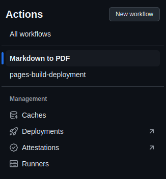
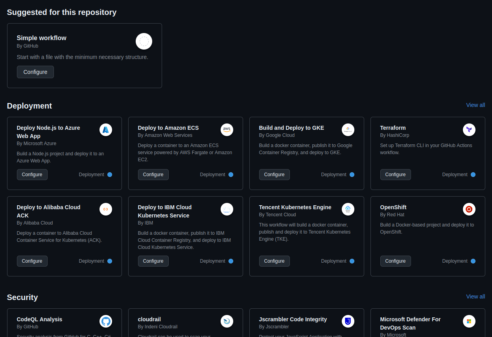
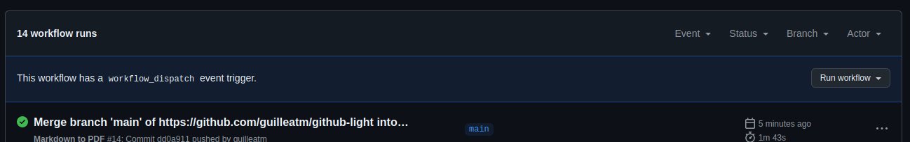
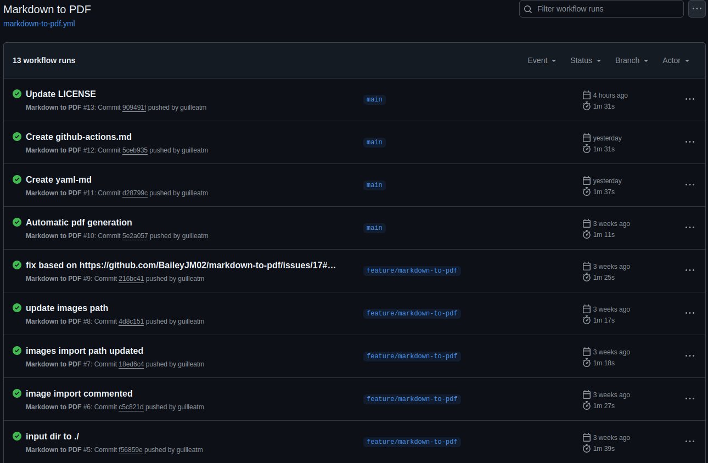
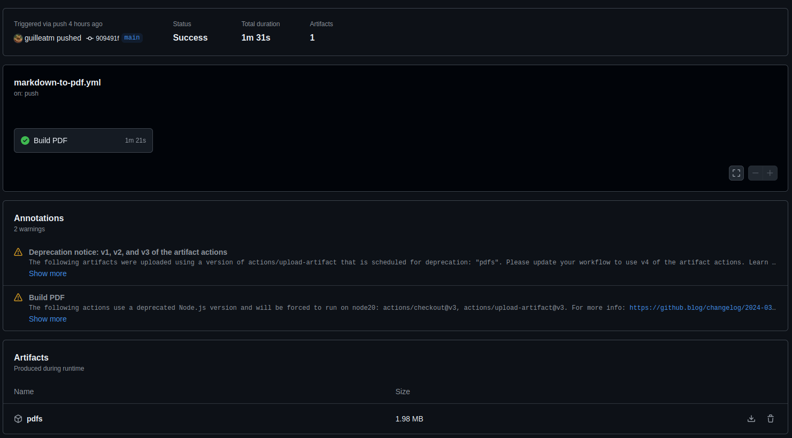
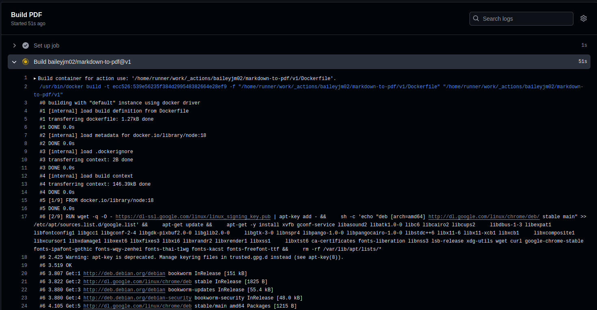

# Github Actions

*Github Actions* es un servicio que ofrece Github con el que podemos automatizar procesos. En muchas ocasiones los proyectos de software requieren de testeo, despliegue o comprobaciones por ejemplo.

Si cada vez que queremos hacer un cambio en nuestra página web, subir la build de nuestro juego a la play store o actualizar la imagen de nuestro contenedor docker tenemos que hacerlo a mano vamos a perder mucho tiempo en hacer tareas repetitivas y tediosas en las que podemos, además, cometer errores.

Como solución a esto, tenemos la automatización de procesos, una forma de hacerlo es usando las herramientas que nos proporciona github, en este caso, las `github-actions`.

Si hemos configurado anteriormente nuestro [`gh-pages`](github-pages.md), en nuestro repositorio, en la pestaña de actions deberíamos tener un workflow llamado `pages-build-deployment`. Si no, podemos verlo en las [actions de este repositorio](https://github.com/guilleatm/github-light/actions).




Como podemos intuir, en realidad la página web que se nos está generando no es magia, sino un workflow configurado para que cuando haya cambios en el repositorio, haga una serie de pasos para hacer el despliegue.

> Aunque el servicio se llama Github Actions, los repositorios tienen configurados lo que llamamos Workflows.

Por supuesto, podemos crear nuestros propios workflows, ahora veremos cómo hacerlo pero también podemos usar workflows existentes, podemos ver algunos si pulsamos en `New Workflow`. 



## Workflow personalizado

Bien, vamos a hacer nuestro propio workflow. Los workflows utilizan actions. Una action es un programa que hace algo sobre el repositorio. Un workflow suele estar consituido por varias actions.

Para crear nuestro workflow necesitaremos simplemente un archivo YAML (`.yml`) con unas configuraciones. Esto es un ejemplo sencillo de workflow.

```yaml
# This is a basic workflow to help you get started with Actions

name: My Workflow

# Controls when the workflow will run
on:
  # Triggers the workflow on push or pull request events but only for the "main" branch
  push:
    branches: [ "main" ]
  pull_request:
    branches: [ "main" ]

  # Allows you to run this workflow manually from the Actions tab
  workflow_dispatch:

# A workflow run is made up of one or more jobs that can run sequentially or in parallel
jobs:
  # This workflow contains a single job called "build"
  build:
    # The type of runner that the job will run on
    runs-on: ubuntu-latest

    # Steps represent a sequence of tasks that will be executed as part of the job
    steps:
      # Checks-out your repository under $GITHUB_WORKSPACE, so your job can access it
      - uses: actions/checkout@v4

      # Runs a single command using the runners shell
      - name: Run a one-line script
        run: echo Hello, world!

```

Qué hace este workflow? Absolutamente nada, claro está, simplemente arranca un ubuntu, copia el contenido de nuestro repositorio al ubuntu y ejecuta el comando `echo Hello, world!`. Pero podemos aprender algo de esto.

Lo primero es la la estructura del `.yml`, esta es la estructura básica que tendrán nuestros workflows. Si leemos los comentarios podemos entender más o menos qué hace cada cosa. Lo segundo es que necesitamos saber YAML.

Hemos preparado una [breve introducción a YAML](yaml.md), léela antes de continuar.

Una de las cosas clave es el uso de las actions. En este caso estamos usando la versión 4 del action checkout (`uses: actions/checkout@v4`). Podemos ver el código de este action [aquí](https://github.com/actions/checkout). Este action copia el contenido de nuestro repositorio a la máquina virtual.

> Dejamos aquí la documentación de github relevante para ampliar conocimientos: [Documentación workflows](https://docs.github.com/en/actions/writing-workflows/quickstart) | [Sintaxis `YAML` para `gh-actions`](https://docs.github.com/en/actions/writing-workflows/workflow-syntax-for-github-actions)


---

Como ya sabemos, esta misma documentación, es un repositorio de github configurado con `gh-pages` y con cada página siendo un archivo `markdown` (`.md`). Hay gente que prefiere leer un documento `pdf` en vez de una web, pues bien, es relativamente facil generar un `pdf` a partir de un `markdown` utilizando alguna herramienta online, por ejemplo [esta](https://md2pdf.netlify.app/).

* Problema: Si actualizamos nuestro repositorio con nuevas páginas, ampliaciones o correcciones tenemos que volver cada vez a generar los `pdf`s.

* Solución: Automatizar el proceso.

Pues bien, vamos a crear un workflow para generar `pdf`s a partir de un repositorio con documentos `markdown`.

> Si no tenemos el repositorio en el que creamos una web estática con `markdown` que hicimos en [Github Pages](github-pages.md), podemos crear un repositorio nuevo con un archivo `.md`, por ejemplo el `README.md`.

Por suerte para nosotros existe un action para esto: [Markdown to PDF Action](https://github.com/BaileyJM02/markdown-to-pdf)

### 1. Crear el archivo de Workflow

Para que github detecte nuestros workflows, tendremos que tener nuestro archivo `.yml` en una ubicación concreta, en la raíz de nuestro repositorio, en el directorio `.github/workflows/`

> Los documentos o carpetas que empiezan con `.` suelen ocultarse en el explorador de archivos, es el caso del directorio `.git` y `.github`. Dependiendo del SO puedes verlos de una forma u otra aunque probablemente en el explorador de archivos de tu IDE sí que se muestren.

Debería quedarnos una estructura de carpetas similar a esta:

**`/`**  
|-- `README.md`  
|-- `my_markdown_document.md`  
|-- **`.github`**  
|   '-- **`workflows`**  
|      |-- `markdown-to-pdf.yml`  
|      |-- `my-worflow.yml`  
|      '-- `other-worflow.yml`  
|-- **`images`**  
|   '-- `...`  
'-- **`.git`**  

En nuestro caso hemos llamado al archivo en el que vamos a tener el workflow `markdown-to-pdf.yml`

### 2. Configurar el Workflow

Este es el workflow que hemos creado, se ejecuta automaticamente cuando hacemos un push a la rama main pero podemos correrlo de forma manual también.

Tiene un 'job', se ejecuta en una ubuntu y usa las actions:

* Checkout: Clona nuestro repositorio a la máquina virtual
* Markdown to PDF: Genera los pdf a partir de nuestro repositorio
* Upload artifact: Genera un .zip y lo sube como [artifact [*]](concepts.md#artifact)


```yaml
name: Markdown to PDF
on:
  push:
    branches:
      - main
  workflow_dispatch:  # Manual trigger
jobs:
  build-pdf:
    name: Build PDF
    runs-on: ubuntu-latest
    steps:
      - uses: actions/checkout@v3
      - uses: baileyjm02/markdown-to-pdf@v1
        with:
          input_path: ./
          output_dir: pdfs
          images_dir: ./assets/images
          image_import: assets/images
          build_html: false
      - uses: actions/upload-artifact@v3
        with:
          name: pdfs
          path: pdfs
```

> Podemos ver la documentación del action Markdown to PDF [aquí](https://github.com/BaileyJM02/markdown-to-pdf), de esta forma es como podemos saber qué argumentos acepta y que hemos de poner en `input_path`, `images_dir`, etc.
>
> Hay algo de confusión en la documentación sobre qué poner en `images_dir` y `image_import`. Si surgen problemas hay un issue abierto con solución [aquí](https://github.com/BaileyJM02/markdown-to-pdf/issues/17#issuecomment-1073326738).

### 3. Ejecutar el Workflow

En nuestra configuración, hemos especificado que este workflow se ejecutará cuando se haga un `push` en la rama `main`. Ver [`gh-actions` `on`](https://docs.github.com/en/actions/writing-workflows/workflow-syntax-for-github-actions#on).


```yaml
on:
  push:
    branches:
      - main
  workflow_dispatch:  # Manual trigger
```
Además el `workflow_dispatch` especifica que se pueda ejecutar el workflow de forma manual.



### 4. Disfrutar del Workflow

Una vez hagamos el push, si nos vamos a la pestaña `Actions` de nuestro repositorio, veremos un histórico con todas las ejecuciones.

> [Histórico de ejecuciones de Workflow de este repositorio](https://github.com/guilleatm/github-light/actions/workflows/markdown-to-pdf.yml)



Podemos entrar y ver los detalles así como los errores en el caso de que fallase. Es aquí donde tendremos los artifacts que se han generado para descargar.

> [Ejecucione de Workflow de este repositorio](https://github.com/guilleatm/github-light/actions/workflows/markdown-to-pdf.yml)







Ahora nunca más tendremos que preocuparnos de generar los `pdf`s a mano, cada vez que hagamos un cambio en la documentación se generaran automáticamente.