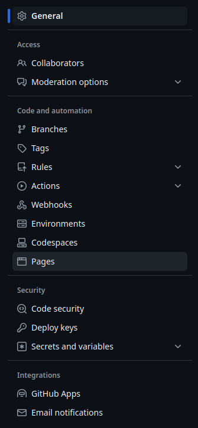
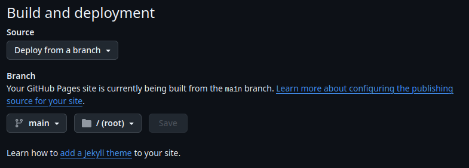

# Github Pages

[**GitHub Pages**](https://pages.github.com/) nos permite alojar sitios web estáticos directamente desde un repositorio de GitHub. Es una excelente herramienta para proyectos pequeños, portafolios, blogs o documentación técnica.

Podemos crear nuestras webs de dos formas diferentes. La más sencilla y directa es utilizando [**Markdown**](markdown-intro.md). Escribiremos texto plano en formato markdown y el propio github se encargará de convertir esto en una página web. Este tipo de sitios se usan habitualmente para documentación, esta misma web está creada de esta manera.

La otra forma es hacer una página web 'convencional' con **HTML**, **CSS** y **javascript** y alojarla en github de forma que este nos haga de hosting gratuito. [Esta](https://guilleatm.github.io/demo-web/) es una web que hemos preparado de muestra.


## Web Markdown

> Antes de nada deberíamos saber qué es [Markdown](markdown-intro.md) y cómo [Escribir Markdown](markdown-syntax.md). Si no has leído esos apartados es un buen momento.

Lo primero que necesitamos es un repositorio en GitHub que contendrá los archivos de nuestro sitio web.  

> Podemos utilizar el repositorio que creamos en [Git](git.md) (`desktop-tutorial`) o crear uno nuevo.
>
> Como es obvio nuestro repositorio tiene que ser público. Si hemos creado uno privado o estamos utilizando `desktop-tutorial` podemos cambiar la visibilidad en `Settings > General > Danger Zone >  Change repository visibility`.

### Contenido

Es el momento de crear el contenido para la web. Nos basta con crear un documento markdown (`.md`) llamado `README.md` o `index.md`. Estos son los ficheros que el navegador espera como página de inicio.

> Si estás usando el proyecto `desktop-tutorial` ves con cuidado ya que el `README` es un `.txt`. Cambia la extensión por `.md`.

Podemos usar este contenido:
```markdown
# Mi primer documento Markdown

* [Este](https://www.markdownguide.org/basic-syntax/) es un enlace a una web en la que se puede aprender markdown.
* Hay un montón de recursos más como [este otro](https://www.markdowntutorial.com/) por ejemplo. En este caso es un tutorial interactivo!
* Último punto en **negrita** y en *cursiva*

> ¿Sabes que este mismo documento está hecho en **markdown**?

Podemos poner incluso imágenes!  

```

### Activar Github Pages

En tu repositorio, ve a `Settings > Pages`.  
Selecciona `Deploy from branch`, puedes seleccionar la rama que quieras, en nuestro caso es `main`.
También puedes seleccionar si el propio repositorio es una página web y está en `root/` o si la web se encuentra en `docs/` esto se utiliza si nuestro repositorio es otra cosa y estamos creando una página web de documentación por ejemplo.

Nosotros utilizaremos `root/`.

<!--    -->


Una vez activemos Github Pages, github se encargará de lanzar la página mediante las `Github Actions`. En la página principal, en la parte `deployments` veremos el estado actual de la web, una vez finalice veremos el enlace en el que podemos acceder a ella.


### Tema

Ahora mismo Github está renderizando nuestra web como markdown. Puede que queramos cambiar un poco el aspecto, podemos hacerlo utilizando los temas. Hay un montón de cosas que podemos hacer con los temas aunque aquí solo cubriremos lo básico. No obstante invitamos al lector a aprender más para conseguir más control sobre la visualización de la web. [Documentación Github + Jekyll](https://docs.github.com/en/pages/setting-up-a-github-pages-site-with-jekyll).

Podemos añadir un tema facilmente a nuestra web. Si nos fijamos, al activar Github Pages, el propio github nos ha creado en nuestro repositorio un documento llamado `_config.yml`. Si no lo ha creado podemos crearlo nosotros.

Podemos leer [cómo añadir un tema](https://docs.github.com/en/pages/setting-up-a-github-pages-site-with-jekyll/adding-a-theme-to-your-github-pages-site-using-jekyll) y los [temas que github soprta](https://pages.github.com/themes/).

> Aunque recomendamos leer detenidamente esta documentación, podemos probar a añadir a nuestro documento `_conf.yml` la siguiente línea: `theme: jekyll-theme-minimal`. Con este cambio tan sencillo, al subir los cambios, github debería desplegar correctamente la web utilizando el tema `minimal`.

> Recuerda que podemos enlazar un documento `.md` con otro utilizando enlaces con rutas relativas. `Enlace a [Mi otro documento](mi-otro-documento.md)`. Así es como funciona la navegación en esta web.


## Web con HTML, CSS y javascript

Para tener más control sobre el diseño y la funcionalidad de nuestro sitio, podemos crear una web estándar (HTML, CSS y javascript) y alojarla en github [*](https://docs.github.com/en/pages/getting-started-with-github-pages/about-github-pages)gratuitamente. 

Para este punto, daremos por hecho que el lector sabe cómo funciona una página web 'convencional'.

Utilizar github como hosting es tan sencillo como crear un repositorio que contenga nuestra web, al igual que en la sección [Web Markdown](#web-markdown) podemos elegir si el repositorio es la web o la web está en `docs`.

Podemos:
* Descargar la web que hemos preparado ([Ver web](https://guilleatm.github.io/demo-web/)) ([Descargar web](https://github.com/guilleatm/demo-web))
* Utilizar la vuestra propia.
* Crear una con el siguiente código.

```html
<!DOCTYPE html>
<html lang="es">
   <head>
       <meta charset="UTF-8">
       <meta name="viewport" content="width=device-width, initial-scale=1.0">
       <title>Mi Web con HTML</title>
   </head>
   <body>
       <h1>Bienvenidos a Mi Web</h1>
       <p>Esta es una página creada con <strong>HTML y CSS</strong>.</p>
   </body>
</html>
   ```

Una vez que subamos los archivos, github publicará automáticamente el sitio web.


## 4. Personalizando la URL

Te habrás dado cuenta de que las url de las páginas son algo así como `https://nombre-usuario.github.io/nombre-repositorio/` 

Podemos personalizar la URL de nuestro sitio agregando un dominio personalizado. Para ello, necesitamos registrar un dominio y configurarlo en la sección **Custom domain** en las opciones de GitHub Pages. 

Puedes encontrar [más información](https://docs.github.com/en/pages/configuring-a-custom-domain-for-your-github-pages-site) en `Settings > Pages > Cusom Domain`.
 
> Github permite que cada usuario tenga un repositorio llamado `nombre-usuario.github.io` este repositorio tendrá github pages activado por defecto y la url quedará tal que `https://nombre-usuario.github.io/` es muy común utilizar este repositorio para una web personal o portfolio.