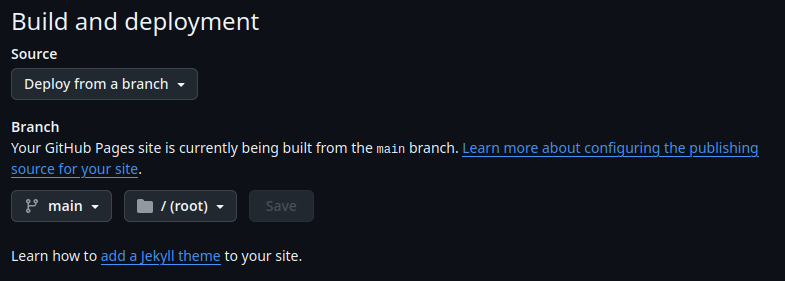

# GitHub

**GitHub** es una plataforma basada en la web que nos permite alojar repositorios Git y colaborar en proyectos. A través de GitHub podemos gestionar versiones de nuestro código, trabajar en equipo y aprovechar una amplia variedad de herramientas que facilitan el desarrollo de software y la documentación. A continuación, veremos algunas de las principales características de GitHub:

## 1. Repositorios Remotos

GitHub nos permite alojar nuestros **repositorios Git** de forma remota. Esto significa que nuestro código y su historial están guardados en la nube, facilitando la colaboración con otras personas y el acceso a nuestros proyectos desde cualquier lugar.

> Cada proyecto en GitHub está representado por un **repositorio**, el cual puede ser público (visible para todos) o privado (solo accesible para colaboradores).

Por ejemplo, este es el [repositorio de **Godot**](https://github.com/godotengine/godot), un motor de videojuegos, podemos ver el código y los commits del proyecto.

## 2. Issues y Proyectos

**Issues** es una herramienta que nos permite gestionar tareas, errores o sugerencias de mejora. Podemos asignar issues a miembros del equipo, añadir etiquetas, discutir posibles soluciones y cerrar los issues una vez que se resuelvan.

Estos son los [issues que la gente va reportando](https://github.com/godotengine/godot/issues?q=is%3Aissue+is%3Aopen+) en el repositorio de Godot, podeis entrar en cualquiera de ellos para ver el problema que estan teniendo y las conversaciones con los desarrolladores.

 

GitHub también ofrece la funcionalidad de **Proyectos** que nos permite organizar nuestras tareas en tableros visuales, facilitando el seguimiento del progreso del equipo. Es una especie de [Trello](https://trello.com/) aunque no es tan intuitivo de entender.

Podeis ver los [Proyectos de Godot](https://github.com/godotengine/godot/projects?query=is%3Aopen).

## 3. Pull Requests

Una de las principales funcionalidades de GitHub es la capacidad de abrir [**Pull Requests** [*]](concepts.md#pull-request). Esto permite que los colaboradores propongan cambios en el proyecto, los cuales pueden ser revisados, comentados y eventualmente aceptados e integrados al código principal.

> Los pull requests nos permiten trabajar en diferentes ramas y mantener la estabilidad del proyecto principal, fomentando la revisión de código antes de la fusión.

Podeis ver la [Lista de Pull Requests de Godot](https://github.com/godotengine/godot/pulls) o los cambios propuestos de [una en concreto](https://github.com/godotengine/godot/pull/97804). Podeis imaginar las pull requests como cambios que la gente propone, estos cambios pueden ser para solucionar bugs o mejorar cosas por ejemplo.

---

## 4. Wiki

GitHub nos ofrece una sección de **Wiki** en cada repositorio para que podamos crear y organizar la documentación del proyecto de forma clara y accesible.

> La Wiki es útil para documentar características, manuales de uso y guías de instalación.

Godot no tiene wiki porque la documentación es extensa y necesita una página web completa con mejores características pero aquí podeis ver la [Wiki de Raylib](https://github.com/raysan5/raylib/wiki), otro proyecto interesantísimo.

## 5. GitHub Pages

**GitHub Pages** nos permite alojar sitios web estáticos directamente desde un repositorio de GitHub. Podemos usarlo para publicar la documentación del proyecto, crear portafolios personales o cualquier tipo de sitio web estático.

### Características de GitHub Pages:
* El sitio web se genera a partir de los archivos de un repositorio.
* Podemos usar Markdown, HTML, CSS y JavaScript.
* Es ideal para **documentación técnica** o páginas personales.

> Para habilitar GitHub Pages, simplemente vamos a la configuración del repositorio y seleccionamos la rama que servirá como fuente del sitio.

Esta misma documentación está hecha con Github Pages. Seguramente os habeis dado cuenta de que podeis ir al [Código fuente de los apuntes](https://github.com/guilleatm/github-light).

Veremos cómo hacer nuestra propia página web estática en [Github Pages](github-pages.md). Lo haremos utilizando markdown (como esta página) y utilizando HTML, CSS y Javascript como esta otra [Web que hemos preparado](https://guilleatm.github.io/demo-web/).

## 6. GitHub Actions

**GitHub Actions** es una herramienta integrada que nos permite automatizar flujos de trabajo. Con ella, podemos configurar **CI/CD** (Integración Continua/Despliegue Continuo) [wikipedia](https://es.wikipedia.org/wiki/CI/CD), ejecutar pruebas automáticas, generar builds o realizar cualquier tipo de tarea automatizada cuando se realizan cambios en el repositorio.

### Usos comunes de GitHub Actions:
* Ejecutar pruebas automáticas al hacer commits.
* Desplegar aplicaciones automáticamente tras realizar un merge.
* Automatizar la creación de versiones del proyecto.

> GitHub Actions utiliza un sistema de **workflows**, donde definimos qué acciones queremos que se ejecuten automáticamente.

> Github Pages utiliza Github Actions para hacer el despliegue de la web.

## 7. Otras características

### Forks

GitHub facilita la colaboración a través de **forks**, que nos permiten hacer una copia completa de un repositorio para trabajar en él sin afectar el original. Esto es muy útil en proyectos de código abierto, donde los usuarios pueden hacer mejoras y luego proponer sus cambios a través de un pull request.

> Los forks nos permiten experimentar con el código y proponer mejoras sin el riesgo de afectar la versión principal del proyecto.

### Seguridad y Permisos

GitHub también cuenta con herramientas de **seguridad**, como la revisión de dependencias y las **alerts** que nos informan si alguno de los paquetes utilizados tiene vulnerabilidades. Además, podemos gestionar permisos y accesos, permitiendo que ciertos colaboradores tengan control sobre el proyecto mientras limitamos el acceso de otros a la lectura.

### Integración con Otras Herramientas

GitHub se integra con muchas otras herramientas como **Slack**, **Jira**, **Trello**, **Visual Studio Code**, **Rider** y más, lo que facilita la automatización de tareas, el seguimiento de progreso y la colaboración dentro de diferentes plataformas.